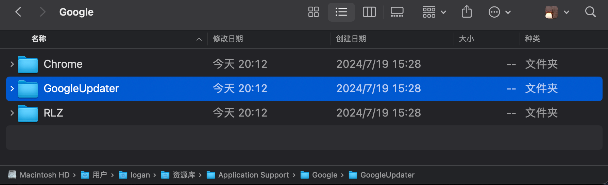
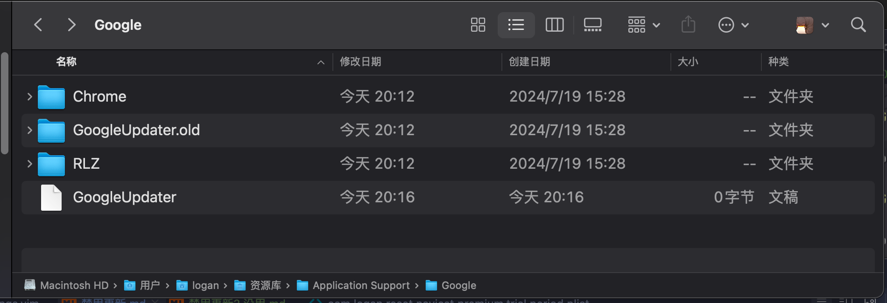

* ~/Library/Application Support/Google 目录下

* 修改前: 



* 修改:

```shell
defaults write com.google.Keystone.Agent checkInterval 0  #禁用更新检测

mv "$HOME/Library/Application Support/Google/GoogleUpdater" "$HOME/Library/Application Support/Google/GoogleUpdater.old"

touch "$HOME/Library/Application Support/Google/GoogleUpdater" #创建同名文件,防止chrome自动创建
```

* 修改后


