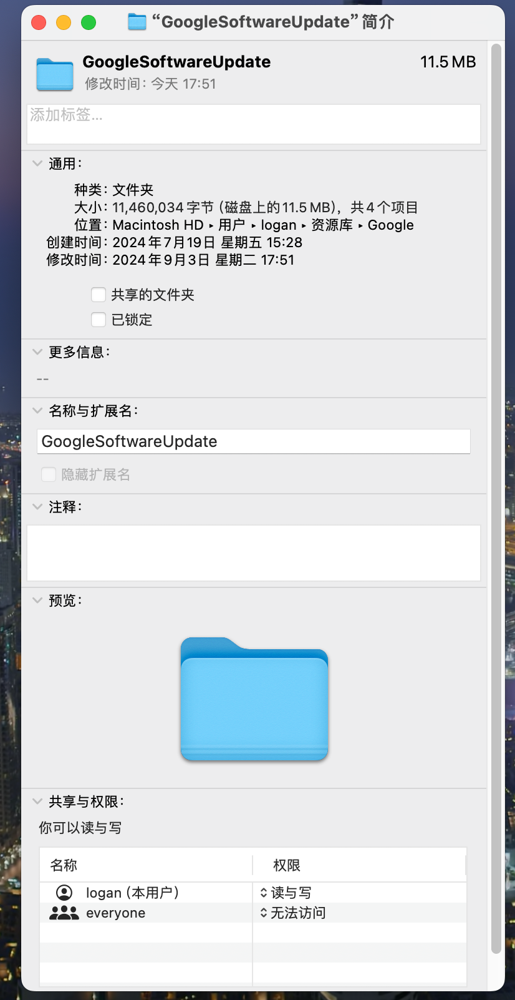

* 修改前的文件夹权限





* 修改权限,来禁用chrome自动更新

```shell
cd ~/Library/Google
sudo chown root:wheel GoogleSoftwareUpdate
```

* 修改后的文件夹权限


* 恢复

```shell
cd ~/Library/Google
sudo chown logan:staff GoogleSoftwareUpdate
```
