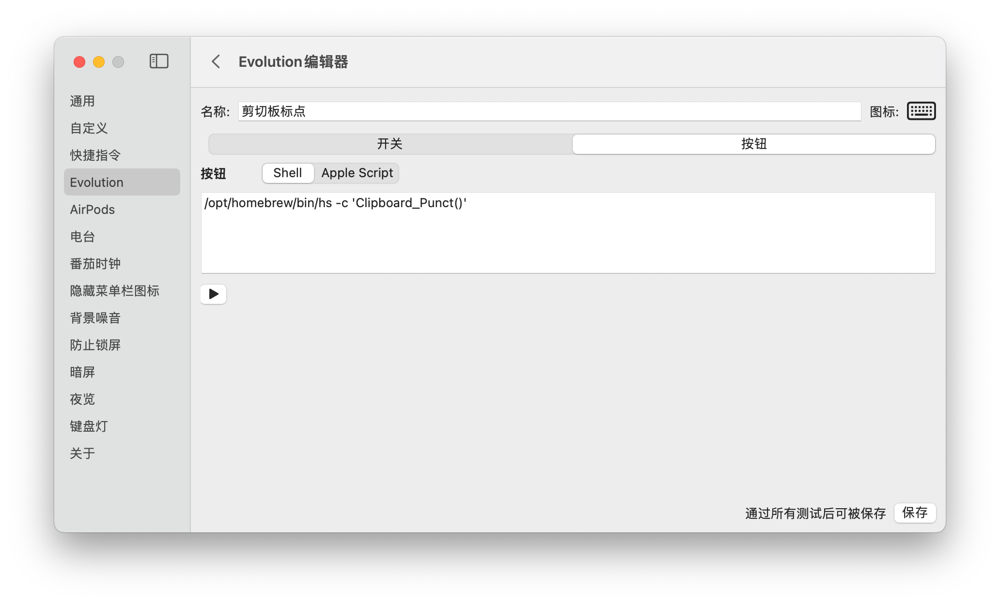
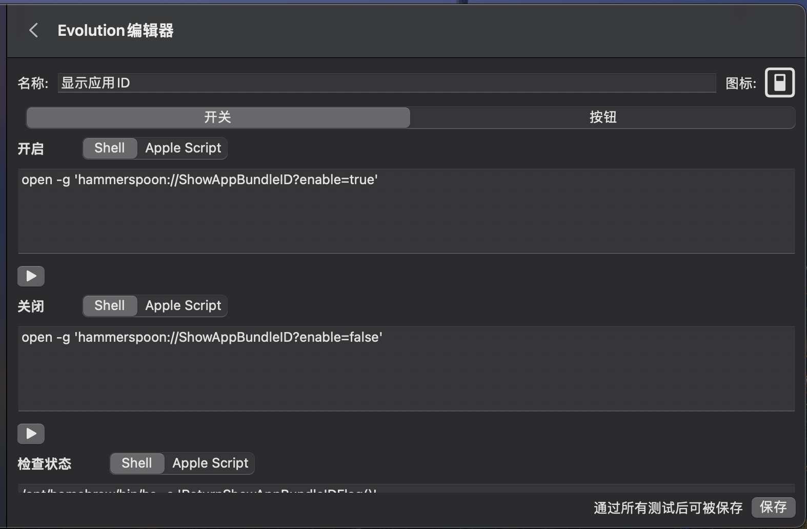
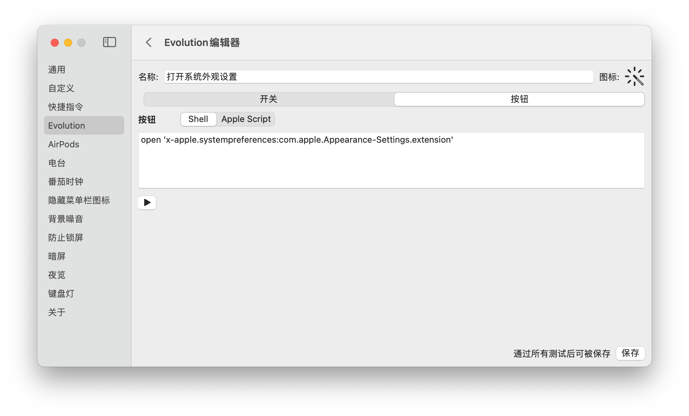

# Evolution


##  1、剪切板标点  



```shell
/opt/homebrew/bin/hs -c 'Clipboard_Punct()'
```

## 2、智能标点


```shell
# 开启(shell)
/opt/homebrew/bin/hs -c 'Smart_Punct_Start()'

# 关闭(shell)
/opt/homebrew/bin/hs -c 'Smart_Punct_Stop()'

# 状态(shell)
/opt/homebrew/bin/hs -c 'Smart_Punct_Status()'

# 输出 1
```

## 3、显示应用ID



```shell
# 开启(shell)
open -g 'hammerspoon://ShowAppBundleID?enable=true'

# 关闭(shell)
open -g 'hammerspoon://ShowAppBundleID?enable=false'

# 状态(shell)
/opt/homebrew/bin/hs -c 'ReturnShowAppBundleIDFlag()'

# 输出 1
```

## 4、低电量模式


```shell

# 开启(AppleScript)
tell application "Shortcuts Events"
    run shortcut "开启低电量模式"
end tell

# 关闭(AppleScript)
tell application "Shortcuts Events"
    run shortcut "关闭低电量模式"
end tell

# 状态(shell)
# 以下为 sh 脚本, 不能使用双引号
output=$(pmset -g | grep lowpowermode || true)
if [ x$output != x ]; then
    echo $output | grep -q '1' && echo 1 || echo 0
else
    output=$(pmset -g | grep powermode || true)
    echo $output | grep -q '1' && echo 1 || echo 0
fi

# 输出 1
```

## 5、台前调度


```shell

# 开启(shell)
defaults write com.apple.WindowManager GloballyEnabled -bool true

# 关闭(shell)
defaults write com.apple.WindowManager GloballyEnabled -bool false

# 状态(shell)
defaults read com.apple.windowManager GloballyEnabled

# 输出 1
```

## 6、获取网络信息


```shell
tell application "Shortcuts Events"
    run shortcut "IP-Address-Information"
end tell
```

## 7、刷新DNS缓存


```shell

tell application "Shortcuts Events"
    run shortcut "Flush-DNS-Cache"
end tell

```

## 8、打开系统外观设置



```shell
open 'x-apple.systempreferences:com.apple.Appearance-Settings.extension'
```

## 9、清空废纸篓


```shell

tell application "Finder"
	-- 我本地默认执行这个就没有确认提示框
	-- set warns before emptying of trash to false
	-- 判断废纸篓中是否有内容,空废纸篓不然会报错(包括隐藏文件,只要是通过 Finder 删除的都会统计)
	if (count of items in trash) > 0 then
		empty trash
		do shell script "open -g 'hammerspoon://ExternalAlertUrl?msg=清理废纸篓成功'"
	else
		do shell script "/opt/homebrew/bin/hs -c 'LOGAN_ALERT(\"未执行,废纸篓已经是空的了!\")'"
	end if
	-- set warns before emptying of trash to true
end tell

```

## 10、Hide Desktop Widget(不用)


```shell

# 开启(shell)
defaults write com.apple.WindowManager StandardHideWidgets -bool true

# 关闭(shell)
defaults write com.apple.WindowManager StandardHideWidgets -bool false

# 状态(shell)
defaults read com.apple.WindowManager StandardHideWidgets

# 输出 1

```

## 11、Hide Desktop Icons(不用)


```shell

# 开启(shell)
defaults write com.apple.WindowManager StandardHideDesktopIcons -bool true

# 关闭(shell)
defaults write com.apple.WindowManager StandardHideDesktopIcons -bool false

# 状态(shell)
defaults read com.apple.WindowManager StandardHideDesktopIcons

# 输出 1
```
