# Evolution

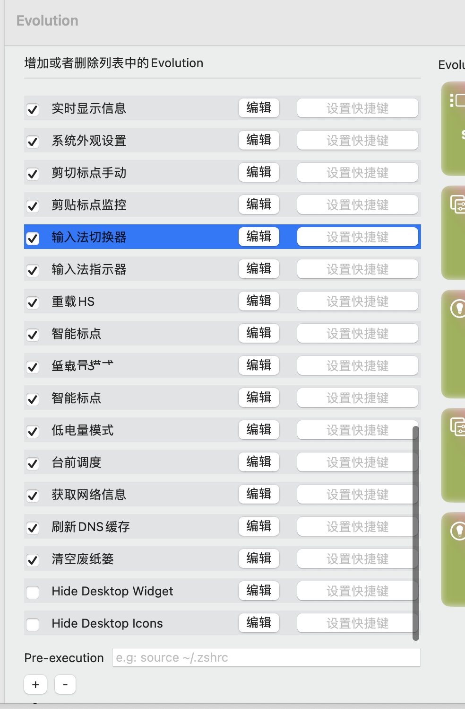

## 1、输入法切换器

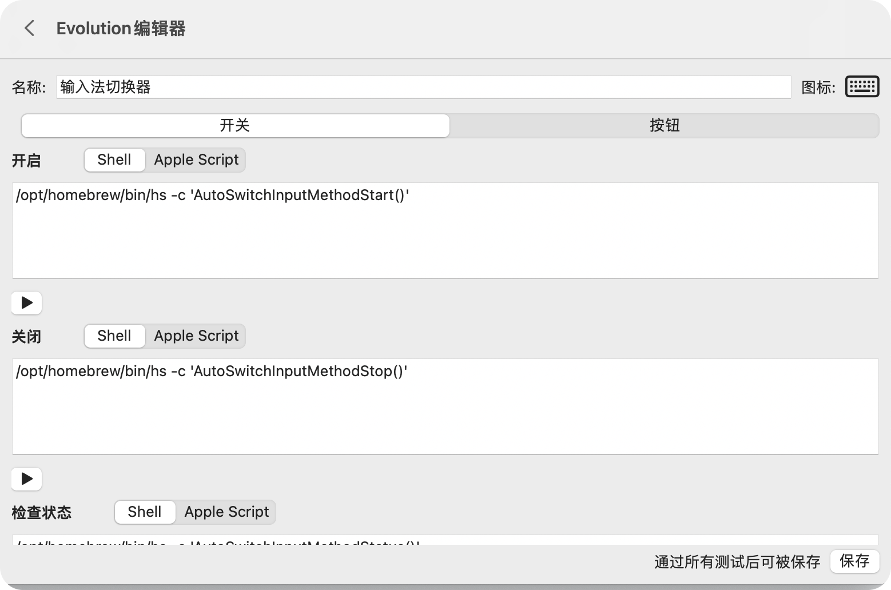

```shell
# 开启(shell)
if [ -x /opt/homebrew/bin/hs ] && pgrep -x Hammerspoon > /dev/null; then
    /opt/homebrew/bin/hs -c 'AutoSwitchInputMethodStart()'
fi

# 关闭(shell)
if [ -x /opt/homebrew/bin/hs ] && pgrep -x Hammerspoon > /dev/null; then
    /opt/homebrew/bin/hs -c 'AutoSwitchInputMethodStop()'
fi

# 状态(shell)
if [ -x /opt/homebrew/bin/hs ] && pgrep -x Hammerspoon > /dev/null; then
    /opt/homebrew/bin/hs -c 'AutoSwitchInputMethodStatus()'
else
    echo 0
fi

# 输出 1

```

## 2、输入法指示器

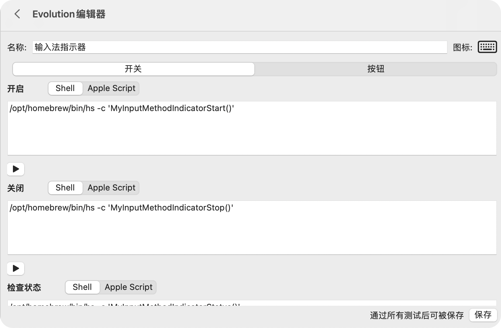

```shell
# 开启(shell)
if [ -x /opt/homebrew/bin/hs ] && pgrep -x Hammerspoon > /dev/null; then
    /opt/homebrew/bin/hs -c 'MyInputMethodIndicatorStart()'
fi

# 关闭(shell)
if [ -x /opt/homebrew/bin/hs ] && pgrep -x Hammerspoon > /dev/null; then
    /opt/homebrew/bin/hs -c 'MyInputMethodIndicatorStop()'
fi

# 状态(shell)
if [ -x /opt/homebrew/bin/hs ] && pgrep -x Hammerspoon > /dev/null; then
    /opt/homebrew/bin/hs -c 'AutoSwitchInputMethodStatus()'
else
    echo 0
fi

# 输出 1
```

## 3、剪切标点手动

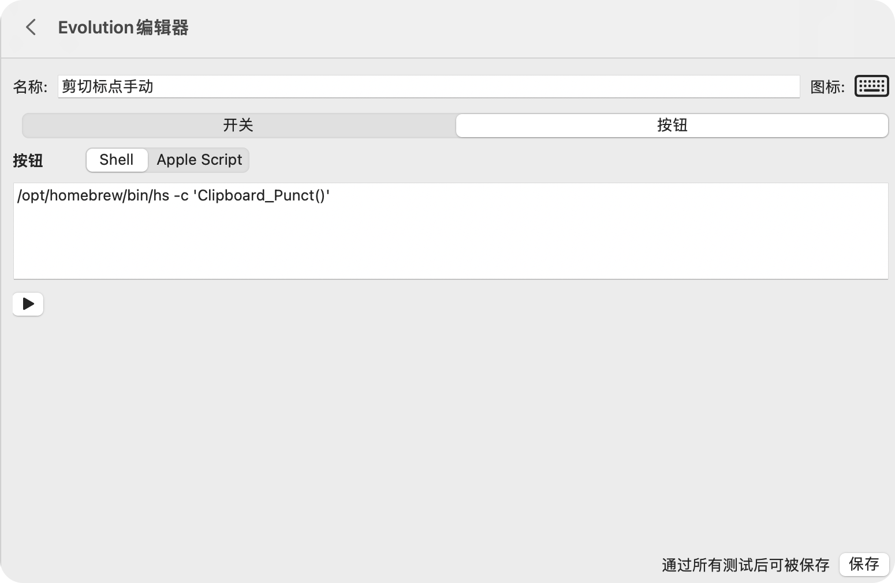

```shell
if [ -x /opt/homebrew/bin/hs ] && pgrep -x Hammerspoon > /dev/null; then
    /opt/homebrew/bin/hs -c 'Clipboard_Punct()'
fi
```

## 4、剪切标点监控

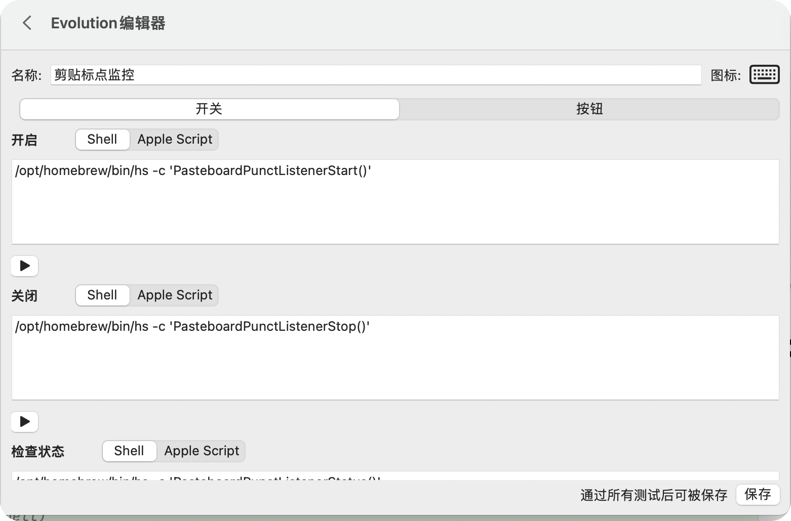

```shell
# 开启(shell)
if [ -x /opt/homebrew/bin/hs ] && pgrep -x Hammerspoon > /dev/null; then
    /opt/homebrew/bin/hs -c 'PasteboardPunctListenerStart()'
fi

# 关闭(shell)
if [ -x /opt/homebrew/bin/hs ] && pgrep -x Hammerspoon > /dev/null; then
    /opt/homebrew/bin/hs -c 'PasteboardPunctListenerStop()'
fi

# 状态(shell)
if [ -x /opt/homebrew/bin/hs ] && pgrep -x Hammerspoon > /dev/null; then
    /opt/homebrew/bin/hs -c 'PasteboardPunctListenerStatus()'
else
    echo 0
fi

# 输出 1
```

## 5、实时显示信息


```shell
# 开启(shell)
if [ -x /opt/homebrew/bin/hs ] && pgrep -x Hammerspoon > /dev/null; then
    /opt/homebrew/bin/hs -c 'ShowInformationStart()'
fi

# 关闭(shell)
if [ -x /opt/homebrew/bin/hs ] && pgrep -x Hammerspoon > /dev/null; then
    /opt/homebrew/bin/hs -c 'ShowInformationStop()'
fi

# 状态(shell)
if [ -x /opt/homebrew/bin/hs ] && pgrep -x Hammerspoon > /dev/null; then
    /opt/homebrew/bin/hs -c 'ShowInformationStatus()'
else
    echo 0
fi

# 输出 1
```

## 6、重载HS(hammerspoon)


```shell
if [ -x /opt/homebrew/bin/hs ] && pgrep -x Hammerspoon > /dev/null; then
    /opt/homebrew/bin/hs -c 'MY_RELOAD()'
fi
```

## 7、获取网络信息(不用了,macos15可以直接在onlyswitch中选择快捷指令了)


```shell
tell application "Shortcuts Events"
    run shortcut "IP-Address-Information"
end tell
```

## 8、刷新DNS缓存(不用了,macos15可以直接在onlyswitch中选择快捷指令了)

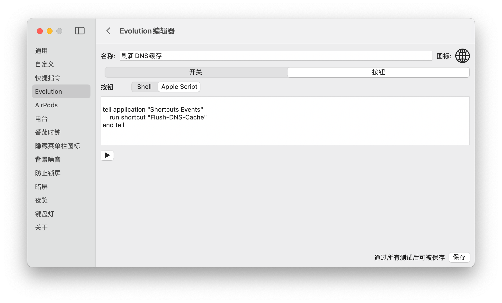

```shell

tell application "Shortcuts Events"
    run shortcut "Flush-DNS-Cache"
end tell

```

## 9、系统外观设置

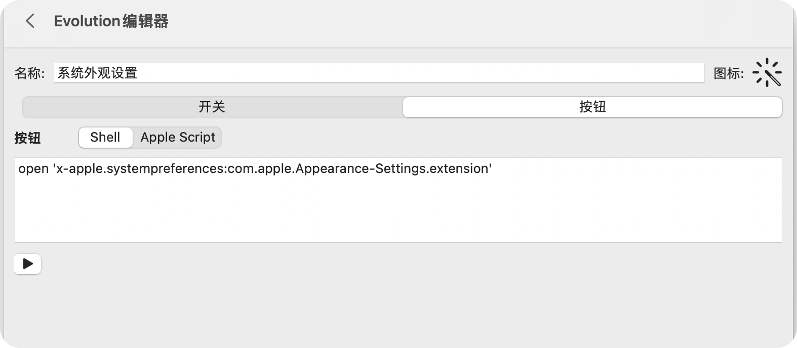

```shell
open 'x-apple.systempreferences:com.apple.Appearance-Settings.extension'
```

## 10、台前调度

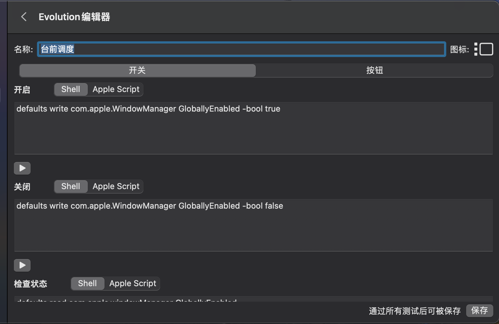

```shell

# 开启(shell)
defaults write com.apple.WindowManager GloballyEnabled -bool true

# 关闭(shell)
defaults write com.apple.WindowManager GloballyEnabled -bool false

# 状态(shell)
defaults read com.apple.windowManager GloballyEnabled

# 输出 1
```

## 11、低电量模式(不用了,系统电池菜单自带了)

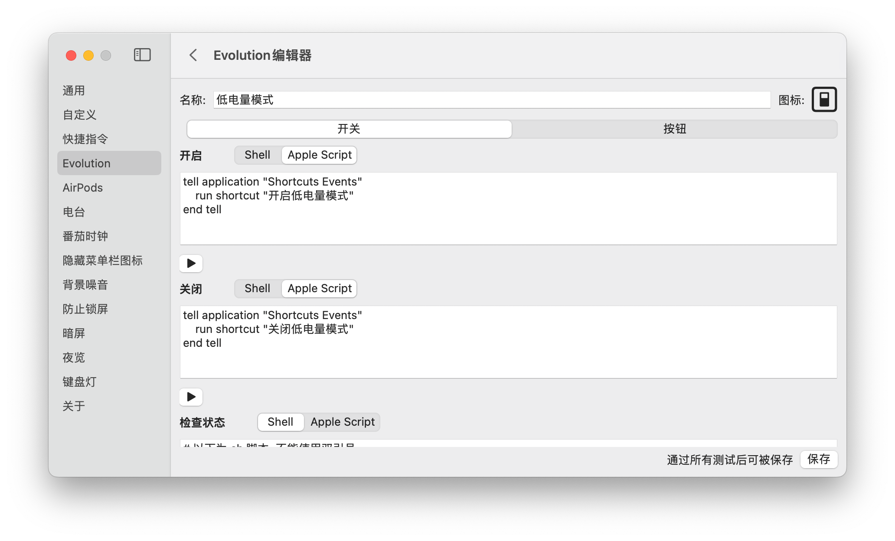

```shell

# 开启(AppleScript)
tell application "Shortcuts Events"
    run shortcut "开启低电量模式"
end tell

# 关闭(AppleScript)
tell application "Shortcuts Events"
    run shortcut "关闭低电量模式"
end tell

# 状态(shell)
# 以下为 sh 脚本, 不能使用双引号
output=$(pmset -g | grep lowpowermode || true)
if [ x$output != x ]; then
    echo $output | grep -q '1' && echo 1 || echo 0
else
    output=$(pmset -g | grep powermode || true)
    echo $output | grep -q '1' && echo 1 || echo 0
fi

# 输出 1
```

## 12、智能标点

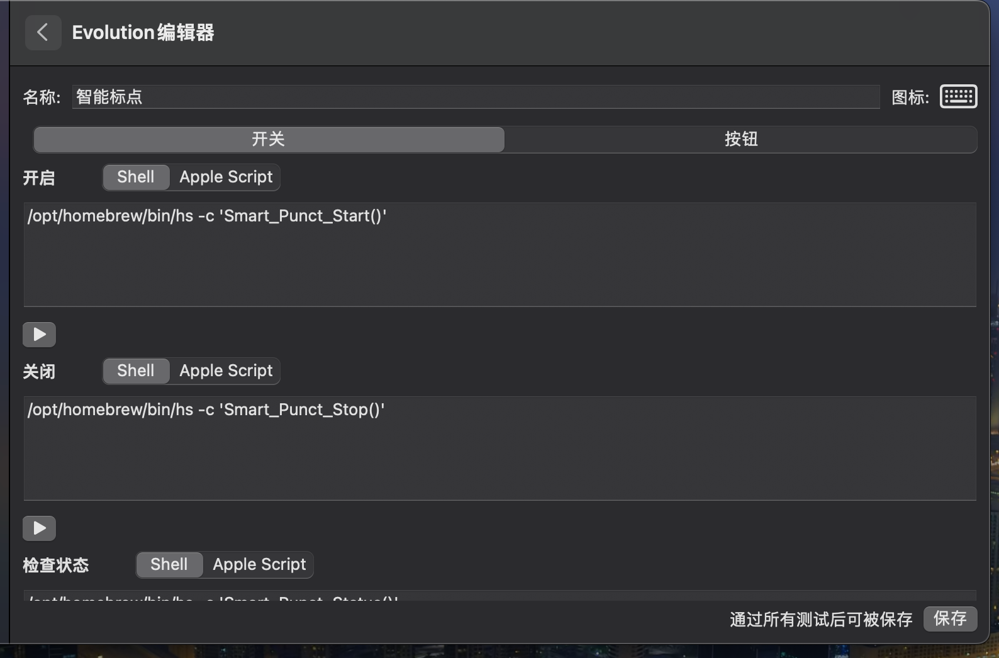

```shell
# 开启(shell)
if [ -x /opt/homebrew/bin/hs ] && pgrep -x Hammerspoon > /dev/null; then
    /opt/homebrew/bin/hs -c 'Smart_Punct_Start()'
fi

# 关闭(shell)
if [ -x /opt/homebrew/bin/hs ] && pgrep -x Hammerspoon > /dev/null; then
    /opt/homebrew/bin/hs -c 'Smart_Punct_Stop()'
fi

# 状态(shell)
if [ -x /opt/homebrew/bin/hs ] && pgrep -x Hammerspoon > /dev/null; then
    /opt/homebrew/bin/hs -c 'Smart_Punct_Status()'
else
    echo 0
fi

# 输出 1
```

## 13、清空废纸篓

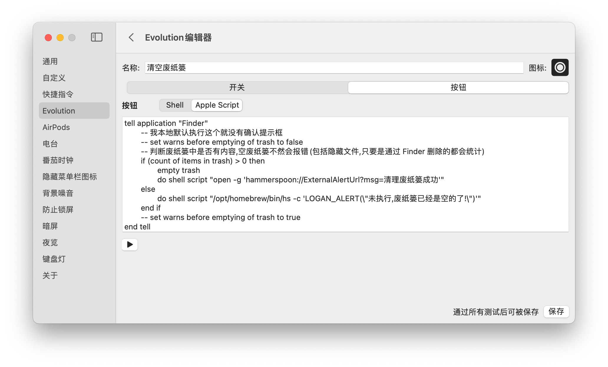

```shell
tell application "Finder"
	-- 我本地默认执行这个就没有确认提示框
	-- set warns before emptying of trash to false
	-- 判断废纸篓中是否有内容,空废纸篓不然会报错(包括隐藏文件,只要是通过 Finder 删除的都会统计)
	if (count of items in trash) > 0 then
		empty trash
		do shell script "if [ -x /opt/homebrew/bin/hs ] && pgrep -x Hammerspoon > /dev/null; then open -g 'hammerspoon://ExternalAlertUrl?msg=清理废纸篓成功'; fi"
	else
		do shell script "if [ -x /opt/homebrew/bin/hs ] && pgrep -x Hammerspoon > /dev/null; then /opt/homebrew/bin/hs -c 'LOGAN_ALERT(\"未执行,废纸篓已经是空的了!\")'; fi"
	end if
	-- set warns before emptying of trash to true
end tell
```

## 13、Hide Desktop Widget(不用)

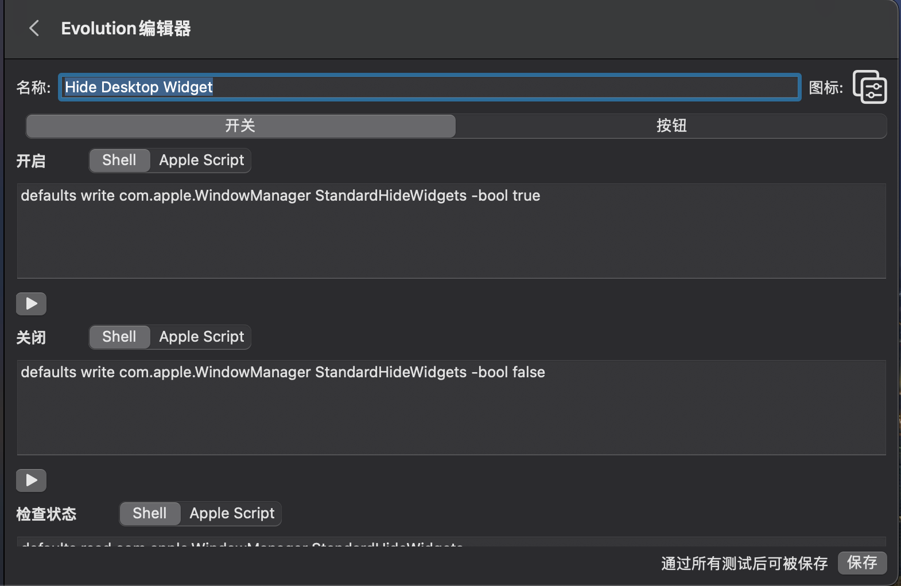

```shell

# 开启(shell)
defaults write com.apple.WindowManager StandardHideWidgets -bool true

# 关闭(shell)
defaults write com.apple.WindowManager StandardHideWidgets -bool false

# 状态(shell)
defaults read com.apple.WindowManager StandardHideWidgets

# 输出 1

```

## 14、Hide Desktop Icons(不用)

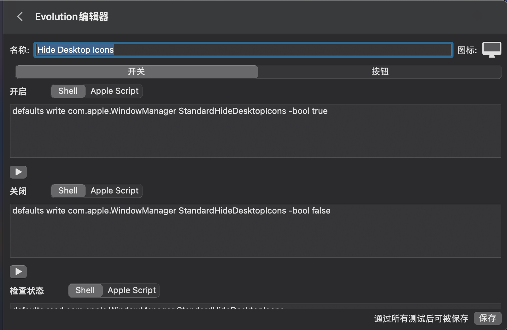

```shell

# 开启(shell)
defaults write com.apple.WindowManager StandardHideDesktopIcons -bool true

# 关闭(shell)
defaults write com.apple.WindowManager StandardHideDesktopIcons -bool false

# 状态(shell)
defaults read com.apple.WindowManager StandardHideDesktopIcons

# 输出 1
```
